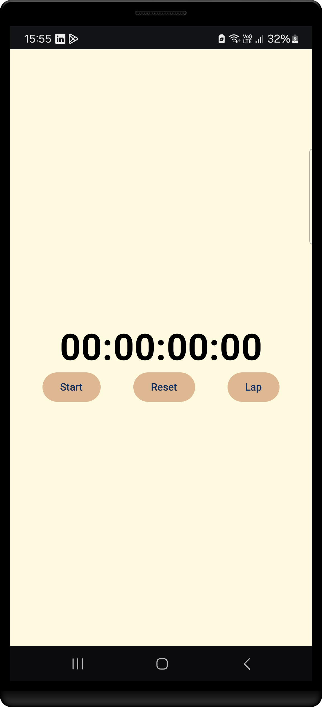
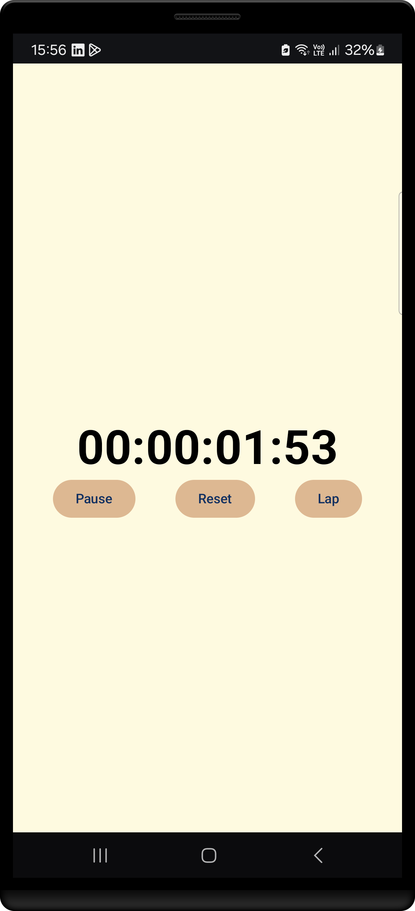
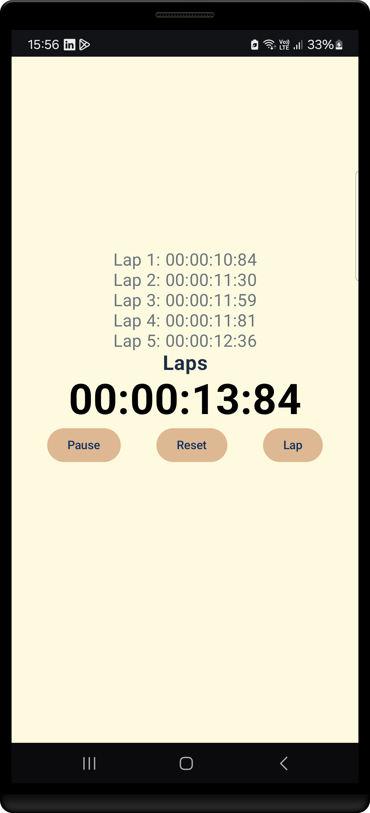

# Stopwatch Application

This is a simple and functional Stopwatch application built using **Jetpack Compose** and **Kotlin**. The app demonstrates modern Android development best practices with clean architecture, state management using `ViewModel`, and dependency injection via `Koin`.

---

## Features

- **Start/Stop Stopwatch:** Users can start and stop the stopwatch.
- **Reset Stopwatch:** Resets the stopwatch to zero.
- **Lap Feature:** Users can record laps while the stopwatch is running.
- **Reusable Components:** The UI is modularized into reusable Composable functions for better maintainability.
- **State Management:** Handles state efficiently using `ViewModel`.

---

## Technologies Used

- **Kotlin**: The programming language for Android app development.
- **Jetpack Compose**: Modern, declarative UI toolkit for building native UIs.
- **ViewModel**: To manage the state and business logic of the application.
- **Koin**: Dependency injection library for managing dependencies.
- **Material Design 3 (MDC)**: Ensures the app follows modern design guidelines.

---

## Architecture Overview

The application follows a clean architecture approach:

1. **UI Layer**: Jetpack Compose handles the presentation logic.
    - Modularized into reusable components: `StopwatchDisplay`, `LapDisplay`, and `ControlButtons`.
2. **Business Logic Layer**:
    - `ViewModel` manages the state of the stopwatch and laps.
3. **Dependency Injection**:
    - `Koin` provides the required dependencies.

---

## Installation

1. Clone the repository:
   ```bash
   git clone https://github.com/YoussefmSaber/PRODIGY_AD_02.git
   ```
2. Open the project in **Android Studio**.
3. Sync the Gradle files to install dependencies.
4. Build and run the application on an emulator or a physical device.

---

## How to Use

1. Open the app.
2. Tap the **Start** button to begin the stopwatch.
3. Use the **Lap** button to record lap times.
4. Tap **Pause** to stop the stopwatch or **Reset** to clear the time and laps.

---

## Screenshots

| Still Screen                                             | Starting the stop watch                                         | Creating Laps                                                   |
|----------------------------------------------------------|-----------------------------------------------------------------|-----------------------------------------------------------------|
|  |  |  |

---

## Lessons Learned

This project was part of the **Prodigy Internship** as an Android Developer. Through this task, I learned:

- Building modern UIs with **Jetpack Compose**.
- Managing state efficiently with **ViewModel**.
- Implementing **Dependency Injection** using **Koin**.
- Modularity and clean architecture principles.

---

## Future Improvements

- Add animations for a smoother user experience.
- Include dark mode support.
- Add unit tests for Composables and `ViewModel`.
- Enhance the UI with more advanced Material Design components.

---

## License

This project is licensed under the MIT License. See the LICENSE file for details.
